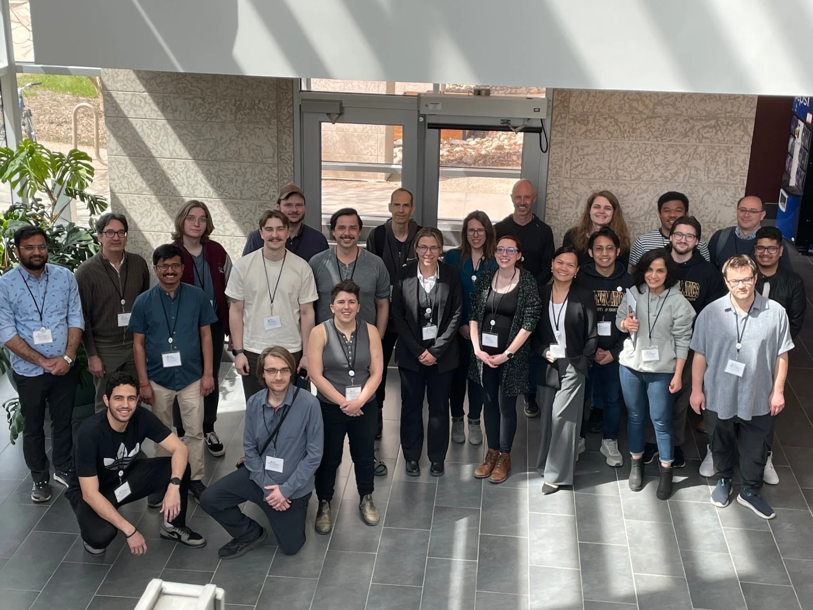
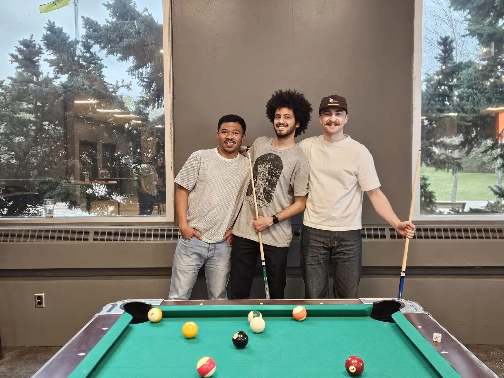
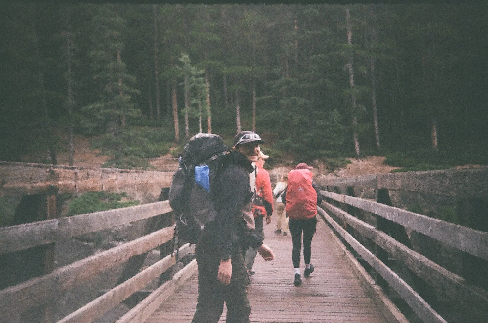
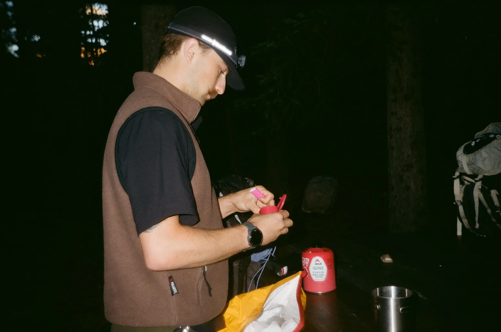

#+title: Gallery

Here are some fun photos from a variety of mathematics events
(and beyond!) throughout the years.

#+ATTR_HTML: :width 100%
#+ATTR_ORG: :width 70%
#+CAPTION: 2026 Prairie Discrete Mathematics Workshop at the University of Regina (May 2026)

#+ATTR_HTML: :width 100%
#+ATTR_ORG: :width 70%
#+CAPTION: Post-PDMW Billiards! (May 2026)

#+ATTR_HTML: :width 100%
#+ATTR_ORG: :width 70%
#+CAPTION: Lake Minnewanka Trail (August 2025)

#+ATTR_HTML: :width 100%
#+ATTR_ORG: :width 70%
#+CAPTION: Lake Minnewanka Trail (August 2025)

